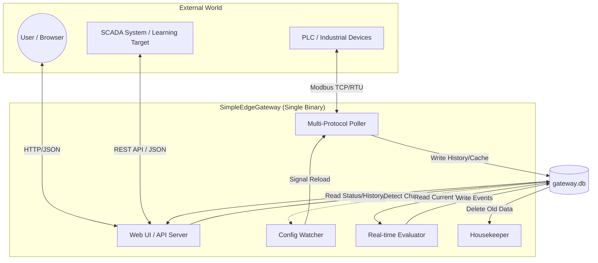
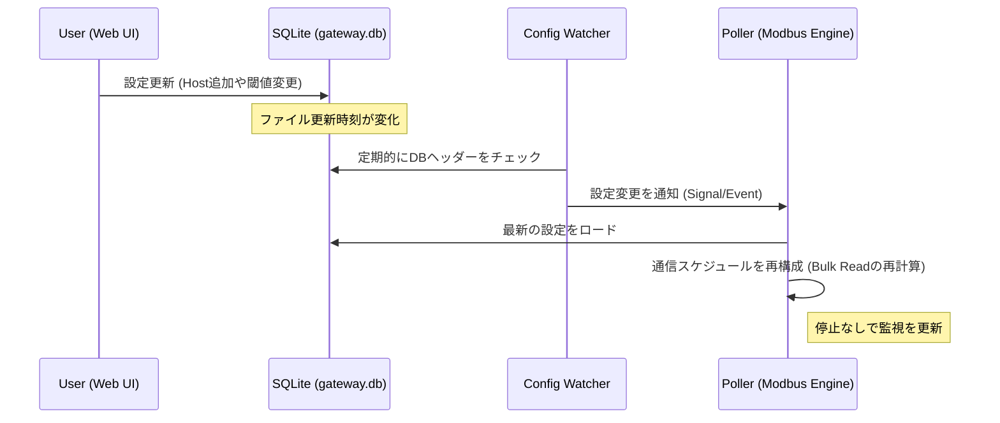
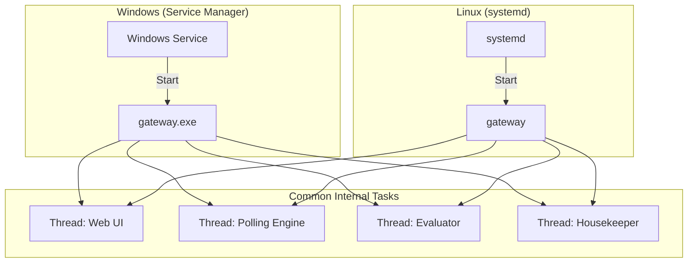

# SimpleEdgeGateway アーキテクチャ

**Date:** 2026/01/19
**Author:** Pekokana
**Status:** Design Freeze
**Version:** 1.1
---

## 1. 概要

SimpleEdgeGatewayは、PLC等の産業機器から届く「生の数字」を、人間や上位システムが理解できる「意味のある情報」に正規化・判定し、アクションを実行する**データベース駆動型（SQLite-centric）エッジサーバー**です。設定・キャッシュ・履歴をすべてDBで管理することで、再起動レスな設定変更と堅牢なデータ保存を実現します。

---

## 2. システム構造とプロセス間連携 (Orchestration)

本システムは、**「Single Binary, Multi-Process/Thread」**の思想で設計されています。

### 2.1. SQLiteを中心とした疎結合

各機能は独立したプロセス（またはスレッド）として動作し、**SQLiteファイル (`gateway.db`) をハブとしてデータ結合**されます。

1. **書き込み（UI/収集）**: Web UIが設定を書き込み、収集機がデータを書き込む。
2. **検知（Watcher）**: 設定変更やデータ更新をDBの更新時刻やトリガーで検知。
3. **読み込み（判定/UI）**: 判定機やUIが最新の状態をDBから読み出す。

### 2.2. 配置と実行形態 (Distribution)

配布・実行を容易にするため、以下の形態をとります。

* **実行ファイル形態**: Python環境がない現場でも動作するよう、`PyInstaller` 等を用いて **Linux/Windows 実行バイナリ (exe)** として1つにパッケージ化して配布。
* **配置**:
* `/opt/simple-edge/gateway` (実行本体)
* `/opt/simple-edge/gateway.db` (データ本体：これさえバックアップすれば移行可能)
* **オーケストレーション**: Linux の場合は `systemd` を使用。OS起動時に1つのサービスとして立ち上がり、内部で「収集」「判定」「Webサーバー」の3つのサブプロセスを自動起動・監視します。

**設計の要諦メモ**:

* **IPCの排除**: プロセス間通信に複雑なQueue等を使わず、すべてをSQLiteの「状態」として管理することで、システムの堅牢性と再起動時の復元性を担保する。
* **疎結合**: UIが止まっても収集は止まらず、収集が止まってもUIは閲覧可能である状態を維持する。

### 2.3. クロスプラットフォーム運用メモ

* **パスの抽象化**: `C:\` 等の絶対パスは使用せず、バイナリ位置を起点とした相対パスでDBを参照。
* **SQLite WALモード**: Windows/Linux共に、読込(UI)と書込(Poller)の競合を避けるため `Write-Ahead Logging` を有効化。

### 2.4. 設計の要諦メモ

* **IPCの排除**: プロセス間通信に複雑なQueue等を使わず、すべてをSQLiteの「状態」として管理することで、システムの堅牢性と再起動時の復元性を担保する。
* **疎結合**: UIが止まっても収集は止まらず、収集が止まってもUIは閲覧可能である状態を維持する。

---

## 3. 4つの主要パイプライン

### ① 収集エンジン (Ingestion)

現場レイヤーとの通信を司り、低負荷・高効率なデータ取得を行います。

* **マルチプロトコル**: Modbus TCP および RTU に対応。
* **タイマー駆動型マルチプレクサ**: `sample_interval`（周期）ごとに収集タスクを分離し、厳格な周期管理を実施。
* **Bulk Read (一括読出し)**: 同一周期・同一ホスト・近接アドレスのアイテムを単一のリクエストに集約。
* **フォールバック・ロジック**: 一括読出し失敗時、自動的に個別読み出しへ切り替え、異常アドレスを特定・一時除外。
* **Host生存確認**: アイテム監視とは独立し、ホスト単位で死活監視を実施。

### ② データ変換・正規化 (Processing)

取得した生データを、判定ロジックが扱いやすい論理データに変換します。

* **物理量変換**: `raw * scale + offset` によるスケーリング処理。
* **タグ抽象化**: 物理アドレスを論理タグ名で管理。
* **変化時保存（Change-based Recording）**: `update_threshold` 以上の変化がない場合はストレージ保存をスキップ。

### ③ 判定ロジック (Analytics / Trigger)

現場の「状態」を判断するエッジの心臓部です。

* **構造化判定**: 演算子と閾値をDBカラムとして保持。
* **チャタリング防止**: `problem_count` / `recovery_count` による連続一致判定。
* **復旧ヒステリシス**: 発火条件とは別に復旧条件（`rect_op / rect_thr`）を定義可能。

### ④ 出力・アクション (Output / Action)

判断結果に基づき、内部記録および外部への通知を行います。

* **状態永続化**: `events` および `history` テーブルへの自動保存。
* **多重アクション**: 1つのトリガーに対して、複数のアクションを1対多で紐付け。
* **Housekeeping**: アイテムごとの `retention_days` に基づく古いデータの自動削除。

#### ⑤ ユーザーインターフェース (Web UI / Dashboard)

エッジサーバー単体で完結する管理・監視画面を提供します。

* **ダッシュボード**: 監視タグの最新値（タグキャッシュ）の一覧表示。
* **アラームコンソール**: 現在発生している障害および過去のイベント履歴の閲覧。
* **設定エディタ**: ブラウザ上から `hosts` や `items` を追加・編集する機能（SQLiteへの書き込み）。

### ⑥ 外部連携 API (Northbound API)

上位システム（SCADA、Dashboard）に対し、標準化されたインターフェースでデータを提供します。

* **REST API**: HTTP/JSON形式で最新値、履歴、アラームサマリを提供。
* **Zabbix API互換形式（検討）**: SCADAが既存の監視ツール用コネクタを利用できるよう、JSON-RPCベースの応答をサポート。
* **リアルタイム性**: WebUIと共有のAPIサーバーが、DBの最新値を即座にJSON化して応答。

---

## 4. 内部プロセス構造

システムは以下の3つの役割が並行稼働します。

1. **Config Watcher (マネージャー)**: SQLiteの変更を検知し、エンジンへ動的リロードを指示。
2. **Multi-Protocol Poller (収集機)**: 設定された周期で各ホストへ通信しキャッシュと履歴を更新。
3. **Real-time Evaluator (判定機)**: データ変化をトリガーに状態判定とアクションを実行。

各機能は独立したスレッドとして動作し、**SQLiteファイル (`gateway.db`) をハブとしてデータ結合**されます。

### 4.1. プロセス間連携図（SQLiteハブ構造）

### 4.2. 設定変更の反映フロー（Watcherの動き）

UIで設定を変更した際、エンジンが「再起動なし」で反映する流れです。

### 4.3. OS別オーケストレーション

---

### 5. Web UI 実装のポイント（深掘り）

このUIは、エッジデバイス（Raspberry Pi等）への負荷を最小限にするため、以下のような構成が理想的です。

* **SQLite連携**: UI自体が `gateway.db` を参照するため、エンジンの動作に干渉しません。
* **APIベース**: PythonでバックエンドAPIを作り、シンプルなHTML/JavaScript（またはStreamlitなど）で表示する。
* **Config Watcherとの連携**: UIで設定を書き換えた瞬間、エンジンの **Config Watcher** がそれを検知して Modbus の収集設定を更新する、という「リアルタイム設定反映」の流れがこれで完成します。

---

## 6. 機能一覧 & 実装ステータス

実装の進捗をここで管理します。

### 核心機能（Core）

* [X] SQLite データベーススキーマ定義
* [X] Python コアエンジン・ループ実装
* [ ] Config Watcher による設定の動的リロード

### 収集（Ingestion）

* [X] Modbus TCP クライアント実装
* [ ] Modbus RTU クライアント実装
* [ ] Bulk Read (一括読出し) アルゴリズム
* [X] 通信エラー時の個別フォールバック・ロジック
* [X] ホスト死活監視（Host Alive Check）

### 解析・保存（Processing & Storage）

* [ ] スケーリング計算ロジック
* [ ] 変化時保存（Change-based Recording）判定
* [ ] アイテムごとのデータ保持期間管理（Housekeeping）

### 判定・通知（Trigger & Action）

* [X] 構造化トリガー判定エンジン（連続回数判定含む）
* [ ] ヒステリシス復旧ロジック
* [X] イベントログ出力アクション
* [ ] MQTT 送信アクション（未着手）
* [ ] メール通知アクション（未着手）

### ユーザーインターフェース（Web UI）

* [X] 軽量Webサーバー（Flask または FastAPI）の選定・構築
* [X] 最新値一覧（Live Data）表示画面
* [ ] イベント・アラーム履歴表示画面
* [X] 監視設定（Hosts/Items/Triggers）のGUI編集機能

### 外部連携（SCADA Integration）

* [ ] **REST API エンドポイントの実装** (latest / history / alerts)
* [ ] **JSONレスポンスの正規化** (SCADAがパースしやすい構造)
* [ ] **APIドキュメント（api_spec.md）の作成**

