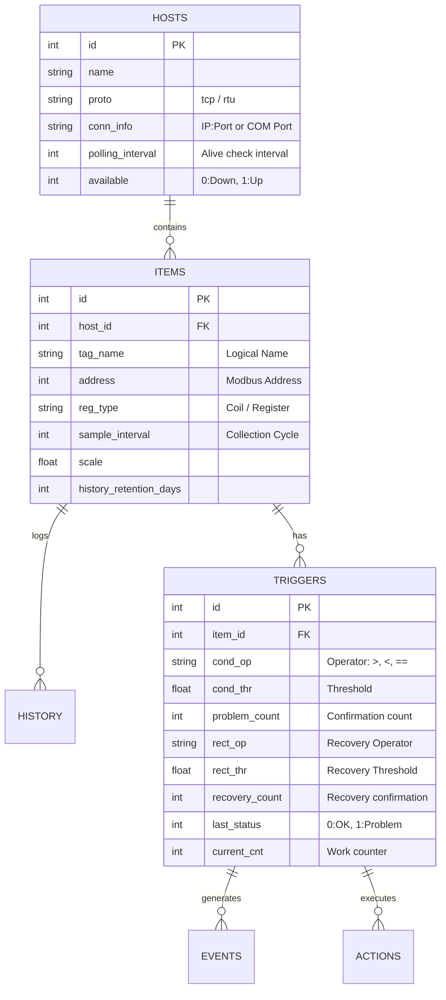

# SimpleEdgeGateway データベース詳細設計 (Database Design)

**Date:** 2026/01/16
**Author:** Pekokana
**Status:** Design Freeze
**Version:** 1.0
**Target DB:** SQLite 3

## 1. エンティティ関係図 (ER Diagram)

SQLiteをハブとして、設定（Hosts/Items/Triggers）から動的なデータ（History/Events）までを一元管理します。



---

## 2. テーブル定義 (Schema SQL)

### 2.1. 接続・収集レイヤー

#### `hosts` - 通信先管理

ホスト単位の生存確認（Alive Check）を行い、通信断時の「不明」状態を一括判定します。

```sql
CREATE TABLE hosts (
    id INTEGER PRIMARY KEY AUTOINCREMENT,
    name TEXT NOT NULL,
    proto TEXT DEFAULT 'tcp',        -- 'tcp' または 'rtu'
    conn_info TEXT NOT NULL,         -- '192.168.1.10:502' または 'COM3'
    polling_interval INTEGER DEFAULT 5, -- 生存確認周期(秒)
    error_count INTEGER DEFAULT 0,   -- 連続失敗回数
    available INTEGER DEFAULT 1,     -- 0:Down, 1:Up
    last_seen DATETIME               -- 最終通信成功時刻
);

```

#### `items` - 監視項目管理

バルクリードのアルゴリズム（周期・ホスト・種別・距離）の基礎となるデータです。

```sql
CREATE TABLE items (
    id INTEGER PRIMARY KEY AUTOINCREMENT,
    host_id INTEGER,
    tag_name TEXT NOT NULL UNIQUE,
    address INTEGER NOT NULL,
    reg_type TEXT NOT NULL,          -- 'coil', 'holding_register', etc.
    sample_interval INTEGER DEFAULT 1, -- 収集周期(秒)
    scale REAL DEFAULT 1.0,          -- 物理量変換係数
    offset REAL DEFAULT 0.0,         -- 物理量変換オフセット
    update_threshold REAL DEFAULT 0.0, -- 変化時保存の閾値
    last_value REAL,                 -- 最新値キャッシュ
    history_retention_days INTEGER DEFAULT 7, -- 保持期間
    FOREIGN KEY(host_id) REFERENCES hosts(id)
);

```

### 2.2. 判定・アクションレイヤー

#### `triggers` - 状態判定

「確信度判定」と「ヒステリシス」をサポートする構造化トリガーです。

```sql
CREATE TABLE triggers (
    id INTEGER PRIMARY KEY AUTOINCREMENT,
    item_id INTEGER,
    name TEXT NOT NULL,
    -- 発火(Problem)条件
    cond_op TEXT NOT NULL,           -- '>', '<', '==', '!=', '>=', '<='
    cond_thr REAL NOT NULL,          -- 発火閾値
    problem_count INTEGER DEFAULT 1,  -- 連続何回で発火か
    -- 復旧(Recovery)条件
    rect_op TEXT,                    -- 空ならcond_opの逆を自動適用
    rect_thr REAL,                   -- 復旧閾値（ヒステリシス）
    recovery_count INTEGER DEFAULT 1, -- 連続何回で復旧か
    -- 内部ステータス
    last_status INTEGER DEFAULT 0,   -- 0:OK, 1:PROBLEM
    current_cnt INTEGER DEFAULT 0,   -- 連続一致回数のワーク領域
    priority INTEGER DEFAULT 3,      -- 1:Info, 2:Warning, 3:High, 4:Critical
    FOREIGN KEY(item_id) REFERENCES items(id)
);

```

#### `actions` - 通知設定

```sql
CREATE TABLE actions (
    id INTEGER PRIMARY KEY AUTOINCREMENT,
    trigger_id INTEGER,
    action_type TEXT,                -- 'log', 'mqtt', 'email'
    target TEXT,                     -- 送信先パス、Topic、アドレス等
    message_template TEXT,           -- 通知文面テンプレート
    FOREIGN KEY(trigger_id) REFERENCES triggers(id)
);

```

### 2.3. データ蓄積レイヤー

#### `history` - 時系列データ

```sql
CREATE TABLE history (
    item_id INTEGER,
    timestamp DATETIME DEFAULT (datetime('now', 'localtime')),
    value REAL,
    PRIMARY KEY (item_id, timestamp)
);
-- 検索高速化のためのインデックス
CREATE INDEX idx_history_item_time ON history(item_id, timestamp);

```

#### `events` - 障害・復旧履歴

```sql
CREATE TABLE events (
    id INTEGER PRIMARY KEY AUTOINCREMENT,
    trigger_id INTEGER,
    timestamp DATETIME DEFAULT (datetime('now', 'localtime')),
    event_type TEXT,                 -- 'PROBLEM' or 'RECOVERY'
    value_at_event REAL,             -- イベント発生時の値
    message TEXT,
    FOREIGN KEY(trigger_id) REFERENCES triggers(id)
);

```

---

## 3. インデックス・最適化戦略

1. **WALモードの有効化**:
収集エンジンとWeb UIの同時アクセス（読込/書込の競合）を回避するため、接続時に `PRAGMA journal_mode=WAL;` を実行します。
2. **Bulk Read用ソートインデックス**:
収集エンジンの起動時、`sample_interval > host_id > reg_type > address` の順で高速にソートできるよう、複合インデックスを検討します。
3. **Housekeeping**:
`history` テーブルは肥大化しやすいため、`history_retention_days` に基づく削除処理を1日1回バッチ実行します。

