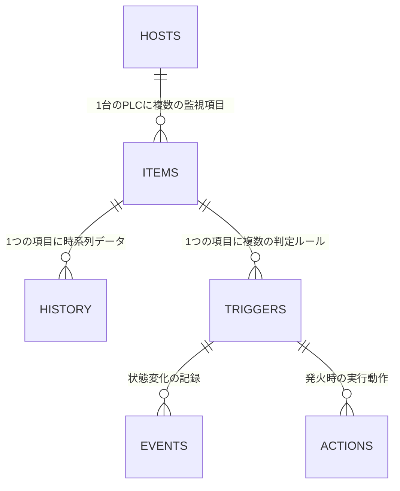

# トリガー・アクション・ハウスキーピング詳細仕様

**Date:** 2026/01/16
**Author:** Pekokana
**Status:** Design Freeze
**Version:** 1.0

## 1. トリガー判定ロジック (Analytics Engine)

本システムのトリガーは、複雑な文字列パースを避け、DBカラムによる「構造化判定」を採用します。これにより、高速かつ安全な実行が可能です。

### 1.1. 判定アルゴリズム（継続条件・ヒステリシス対応）

チャタリング（ノイズによるアラーム連発）を防ぐため、**「連続判定回数」**と**「復旧閾値（不感帯）」**を導入します。

#### **ケースA：現在 [正常 (OK)] の場合**

1. 取得値が `cond_op` / `cond_thr`（発火条件）を満たしているか判定。
2. **満たしている場合**: `current_cnt` を +1。
* `current_cnt >= problem_count` に達したら、**PROBLEM（発火）**とみなし状態を更新。`current_cnt` を 0 にリセット。


3. **満たしていない場合**: `current_cnt` を 0 にリセット。

#### **ケースB：現在 [異常 (PROBLEM)] の場合**

1. 取得値が `rect_op` / `rect_thr`（復旧条件）を満たしているか判定。
* ※復旧条件が未設定の場合は、発火条件の否定（逆）を自動適用。


2. **満たしている場合**: `current_cnt` を +1。
* `current_cnt >= recovery_count` に達したら、**OK（復旧）**とみなし状態を更新。`current_cnt` を 0 にリセット。


3. **満たしていない場合**: `current_cnt` を 0 にリセット。

---

## 2. エンティティ・リレーションシップ (ER)

柔軟な監視体制を実現するため、各要素を「1対多」で紐付けます。

* **アイテム(1) vs トリガー(多)**:
1つの温度計（アイテム）に対し、「警告（60度）」「重故障（80度）」など、複数の閾値を設定可能。
* **トリガー(1) vs アクション(多)**:
「発火時にメールを送る」かつ「現場のパトライトを鳴らす（PLC書き戻し）」など、複数の動作を同時に実行。
* **ホスト(1) vs 生存監視トリガー(1)**:
個別アイテムの異常とは別に、通信そのものの失敗（Timeout等）を監視する専用ロジックを搭載。



---

## 3. PLC死活監視（Host Availability）

個別アイテムの異常と「通信断」を明確に区別します。

* **仕組み**: 通信エラー（Timeout / Connection Refused）発生時にホストの `error_count` をカウントアップ。
* **内部トリガー**: `error_count >= 3` 等の条件でホストを「Down」とみなし、そのホストに紐づく全アイテムの「不明」状態を検知。
* **メリット**: 1つのPLCが落ちた際、100個のアラームが出るのではなく「PLC1号機ダウン」という1つの根本原因のみを通知。

---

## 4. データ掃除（Housekeeping）

エッジデバイスのストレージ容量を保護するため、アイテムごとに保持期間を管理します。

* **設定**: `items.history_retention_days` で保持日数を定義。
* **実行**: 日次バッチまたはバックグラウンドスレッドが以下のSQLを実行。
```sql
DELETE FROM history 
WHERE item_id = ? 
  AND timestamp < datetime('now', '-' || ? || ' days');

```


* **戦略**: 高頻度の生データは短期間（例：7日）、重要な統計データは長期間（例：365日）と使い分けが可能。

---

## 5. アクション実行タイミング

アクション（通知等）は、状態の変化点において以下のタイミングで実行されます。

| タイミング | 説明 | 用途 |
| --- | --- | --- |
| **ON (Problem)** | 状態が OK → PROBLEM になった瞬間。 | アラーム通知、即時停止指令。 |
| **OFF (Recovery)** | 状態が PROBLEM → OK になった瞬間。 | 復旧報告、安全確認ログ。 |
| **Duration (Ongoing)** | 異常状態が継続している間（一定時間ごと）。 | 未対応アラームの再送（エスカレーション）。 |

---

## 6. DBスキーマ定義（トリガー・アクション関連）

```sql
-- トリガーテーブル
CREATE TABLE triggers (
    id INTEGER PRIMARY KEY AUTOINCREMENT,
    item_id INTEGER,
    name TEXT NOT NULL,
    -- 発火条件
    cond_op TEXT NOT NULL,          -- '>', '<', '==' など
    cond_thr REAL NOT NULL,         -- 発火閾値
    problem_count INTEGER DEFAULT 1, -- 連続発火回数
    -- 復旧条件
    rect_op TEXT,                   -- '<', '>' など
    rect_thr REAL,                  -- 復旧閾値
    recovery_count INTEGER DEFAULT 1, -- 連続復旧回数
    -- 状態管理
    last_status INTEGER DEFAULT 0,  -- 0:OK, 1:PROBLEM
    current_cnt INTEGER DEFAULT 0,  -- 現在の連続一致カウント
    priority INTEGER DEFAULT 3,     -- 優先度
    FOREIGN KEY(item_id) REFERENCES items(id)
);

-- アクションテーブル (拡張予定)
CREATE TABLE actions (
    id INTEGER PRIMARY KEY AUTOINCREMENT,
    trigger_id INTEGER,
    action_type TEXT,               -- 'log', 'mail', 'mqtt', 'plc_write'
    target TEXT,                    -- 送信先アドレスやタグ名
    message_template TEXT,          -- 通知文面
    FOREIGN KEY(trigger_id) REFERENCES triggers(id)
);

```
